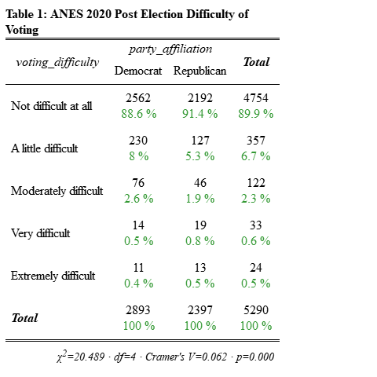

\clearpage

```{r load packages, include=FALSE}
#read file
library(haven)
# for data wrangling
library(dplyr)
library(magrittr)

# for plotting
library(ggplot2) 
library(RColorBrewer)
library(tidyverse) # if you want more, but still core, toolkit

# install.packages("sjPlot") #install for program to work producing cross tab
knitr::opts_chunk$set(echo = TRUE)
library(sjPlot)
# Used to convert sjPlot html table to image for pdf printing purposes
library(webshot)
library(magick)

#knit related packages
library(gridExtra)
library(grid)
library(kableExtra) #To save HTML graph as a png file

library(plotly)
library(cowplot)
library(png)

library(htmlTable)


library(knitr)
opts_template$set(Graph1 = list(fig.height = 4, fig.width = 7),
                  Graph2 = list(fig.height = 4, fig.width = 7)) 
library(patchwork)

options(tinytex.verbose = TRUE)

#set theme for ggplot
theme_set(theme_minimal())
options(warn=-1)
```

```{r load and clean data, echo=FALSE, warning=TRUE, message=FALSE}

# read in stat file from ANES 2020 time series study

anes <- read_dta("anes_timeseries_2020_stata_20210324.dta")


# clean data 

# rename columns for research to a more suitable naming convention and create a party identifier
anes <- anes %>% 
  rename(CSES5_WHPTY = V202443,
    VOTEEXP_VOTEHARD = V202119) %>%
  mutate(
    party_affiliation = case_when(
      CSES5_WHPTY == 1 ~ 'Democrat', 
      CSES5_WHPTY == 3 ~ 'Republican', 
      CSES5_WHPTY==7 ~ 'Other',
      CSES5_WHPTY==-9 ~'Refused',
      CSES5_WHPTY == -7 ~ 'No Post Election Data',
      CSES5_WHPTY == -6 ~ 'No Post Election Interview',
      CSES5_WHPTY == -5 ~ 'Interview Breakoff',
      CSES5_WHPTY == -1 ~ 'Inapplicable',
      TRUE~'Unknown'), 
      )

missing_responses <- anes %>% group_by(party_affiliation) %>% summarise(n = n()) %>% mutate(frequency = n/sum(n))


# filter to records that lean toward democratic or republican party and have a response for how difficult it was to vote 
anes <- anes %>%
  filter(party_affiliation %in% c('Democrat','Republican') &
         VOTEEXP_VOTEHARD > 0 & VOTEEXP_VOTEHARD <=5)%>% 
    mutate(
    voting_difficulty = case_when(
      VOTEEXP_VOTEHARD == 1 ~ 'Not difficult at all', 
      VOTEEXP_VOTEHARD == 2 ~ 'A little difficult', 
      VOTEEXP_VOTEHARD == 3 ~ 'Moderately difficult', 
      VOTEEXP_VOTEHARD == 4 ~ 'Very difficult', 
      VOTEEXP_VOTEHARD == 5 ~ 'Extremely difficult',
      TRUE ~ 'Unknown')) %>%
      select(CSES5_WHPTY,VOTEEXP_VOTEHARD,party_affiliation, voting_difficulty)
    

anes$voting_difficulty  <- factor(anes$voting_difficulty, levels = c(  'Not difficult at all', 'A little difficult', 'Moderately difficult','Very difficult', 'Extremely difficult'))


```


## Importance and Context

### Did Democratic voters or Republican voters report experiencing more difficulty voting in the 2020 election?
To support a true democracy in the United States, participation in the presidential election needs to be equally accessible to all eligible voters in the United States regardless of their party affiliation. Additional challenges and difficulties in voting can prevent or discourage eligible voters from voting. Some of these challenges include obstacles in obtaining an absentee ballot, confusion about the ballot or voting machine, difficulty getting to the polling place, long wait times, work schedule, bad weather, and/or issues mailing in a ballot. Any advantage or disadvantage by one party over another in voting could lead to an unfair election and be a potential threat to democracy.

The coronavirus pandemic introduced new challenges to voting in the 2020 election. A Pew Research Foundation study reported “Voters who support Donald Trump are far more likely than those who support Joe Biden to say it will be easy to vote [in the 2020 election]” (Pew Research, 2020). Moreover, the same study found supporters of each candidate have different preferences on how to vote in the 2020 election, a majority (80%) of Trump supporters preferred to vote in person whereas a majority of Biden (58%) supporters preferred to vote by mail (Pew Research, 2020).  This preference may have been influenced by COVID-19. There is reason to believe that these results for candidate preferences hold for party affiliation as political research has shown party identification is linked with candidate preferences. In this document, we will explore if the reported level of difficulty in voting in the 2020 election is greater for Democrats or Republicans.  


## Description of Data
```{r, echo=FALSE}
all <- sjPlot::tab_xtab(var.row = anes$voting_difficulty, var.col = anes$party_affiliation, title = "Table 1: ANES 2020 Post Election Difficulty of Voting", show.row.prc = FALSE, show.col.prc = TRUE, file="test.html")

screenshot <- webshot("test.html", paste(getwd(),"/", "cross_table1_image.png"), cliprect = "viewport")

image2 <- image_read(paste(getwd(),"/", "cross_table1_image.png")) %>% image_crop("480x480+1")
image_write(image2, path = "cross_table1_image.png", format = "png")


```

```{r pressure, echo=FALSE, out.height="60%", out.width="60%"}

```

The research question above will be addressed using data from the 2020 Time Series Study from the American National Election Studies (ANES), which includes post-election survey responses from respondents that were part of the 2016 General Social Survey (GSS).  As shown in Graph 1, a larger number of Democrat respondents (2,893) versus Republicans (2,397) provided responses about the difficulty in voting. 


```{r, echo=FALSE, message=FALSE, error=FALSE}
anes_hist <- anes %>% 
  ggplot() + 
  aes(x = voting_difficulty, fill = party_affiliation, label=voting_difficulty) + 
  geom_bar(position = 'dodge') + 
  labs(
    title    = 'Graph 1: Totals by Voting Difficulty and Party',
    x        = 'Voting Difficulty',
    y        = 'Count of Respondents', 
    fill     = 'Party Affiliation'
  )+ facet_grid(party_affiliation ~ .) + scale_x_discrete(labels = c('Not difficult at all', 'A little difficult', 'Moderately difficult','Very difficult', 'Extremely difficult'))+
  scale_fill_manual(values=c("blue", "red"))+theme(legend.position="bottom", axis.text = element_text(size = 8))+
geom_text(stat='count', aes(label=..count..),size=3,vjust=-.25)+theme(text = element_text(size = 8), axis.text.x = element_text(angle = 45,hjust=1))+ ylim(0, 3000)


props <- anes %>% group_by(voting_difficulty,party_affiliation) %>% summarise(n = n()) %>% mutate(frequency = n/sum(n))

stacked_bar <- ggplot(props, aes(fill=party_affiliation, y=frequency, x=voting_difficulty)) +
  geom_bar(position="fill", stat="identity") + 
  labs(
    title    = 'Graph 2: Survey Responses by Difficulty',
    x        = 'Voting Difficulty',
    y        = 'Percentage of Responses',
    fill = 'Party Affiliation'
  )+ scale_fill_manual(values=c("blue", "red"))+theme(axis.text = element_text(size = 8))+
    scale_y_continuous(labels = scales::percent)+theme(text = element_text(size = 8)) +
  geom_text(aes(label= paste0('  ', round(frequency,2)*100, '% \n (', n,')')),size=3, position=position_stack(vjust=0.5),color = "white")+theme(legend.position="bottom", axis.text = element_text(size = 8),axis.text.x = element_text(angle = 45,hjust=1))

```

```{r Box Plot and Age Distribution of Political Parties, fig.height= 3.5, fig.align='center',echo=FALSE}
plot_grid(anes_hist, stacked_bar, rel_heights = c(4,4), rel_widths = c(1,1))
```


Graph 2 provides the breakdown of the overall survey responses by difficulty level and party.  As mentioned previously, there were more Democrat responses than Republican responses overall and it is important to note that Democrats are weighted more heavily in the percentages in Graph 2 because of that. Therefore, Graph 2 depicts most of the responses for ‘Not difficult at all’, ‘A little difficult’ or ‘Moderately difficult’ as being Democrats (54%, 64%, and 62% respectively). For the responses of having a ‘Very difficult’ and ‘Extremely difficult’ time voting a majority were Republicans (58% and 54%). However, this slight difference could be attributed to the small number of respondents (57 in total) that reported having a ‘Very difficult’ and ‘Extremely difficult’ time voting.  Moreover, Table 1 provides a more accurate depiction on how Democrats compare to Republicans as the proportions are relative to each party and not the total number of responses.

Table 1 shows that a larger proportion of Republican respondents versus Democrats reported that voting was “Not difficult at all”. Interestingly, a larger portion of Democrats (8% and 2.6%) report having “A little difficult” or “Moderately difficult” time voting when compared to Republicans (5.3% and 1.9% respectively). As shown in Table 1, 89.9% of the combined Democratic and Republican ANES respondents reported voting in 2020 election to be “Not difficult at all”.  Of the 89.9% of respondents, a smaller proportion Democrats (88.6%) reported “No Difficulty at all” versus Republicans (91.4%).Therefore, based on Table 1 it appears that Republicans may have a slight advantage in reported ease of voting over Democrats. 

The survey results include data about how difficult it was to vote during the 2020 election and what political party the respondent leans toward. To address the research question, we selected the “V202119” variable, in which respondents were asked ‘How difficult was it for you to vote in this election?’ and were provided a 5-point Likert scale ranging from 1 (Not difficult at all) to 5 (Extremely difficult). To identify the party affiliation of a respondent we used the V202443 variable survey question in which respondents were asked ‘Which party do you feel closest to?’. After accounting for missing responses and limiting to Democratic or Republican leaning respondents, there are 5,290 observations remaining. The limitations to this data source are that it only represents post-election voters who turned out for this election and does not contain information about the difficulty/challenges of voting for eligible voters who did not cast their ballot (perhaps due to difficulties to voting).

The research question asked if Republicans or Democrats report experiencing more difficulty in the 2020 election. To test this, we need to reformulate this into a statistical hypothesis to be used by our test.  The null hypothesis is that it is equally likely for a Democrat difficulty rank to be either greater than or less than a Republican difficulty rank. The null and alternative hypotheses can be written as follows:

> $$H_0:P\left(Rank\ of\ D>{Rank\ of\ R}\right)=P\left(Rank\ of\ D\le R a n k\ of\ R\right)$$
> $$H_A:P\left(Rank\ of\ D>{Rank\ of\ R}\right)\neq P\left(Rank\ of\ D\le R a n k\ of\ R\right)$$

where D represents a random Democrat and R represents a random Republican

## Most appropriate test 

To answer this question, we determined that the non-parametric Wilcoxon Rank Sum Test is the most appropriate test for this research question.  It can be executed in R using __wilcox.test__.  The main requirements for using this test are:

**1.	Unpaired data:** The grouping variable is party affiliation (Democrat or Republican), and as each respondent can only be affiliated with a single party Republican or Democrat and not both, we consider this unpaired data.

**2.	Ordinal variable:** The main variable for comparison is ordinal scale, which goes from level 1 to 5 (1 = Not Difficult at all, 5 = Extremely Difficult)

**3.	I.I.D. :** The design of the study suggests the data was generated through an independent and identically distributed (i.i.d.) sampling process. Participants in this survey were randomly drawn from the USPS delivery sequence file. The USPS delivery sequence file contains all residential addresses in the 50 states across the U.S. and all addresses had an equal chance of being selected.

We will use p-value as the rejection criteria, with an alpha of 0.05. Thus, if the Wilcox test p-value is less than 0.05, we would reject the null hypothesis (Ho), otherwise, we will fail to reject it.

```{r, include=FALSE}
wilcox_test <- wilcox.test(anes$VOTEEXP_VOTEHARD~anes$party_affiliation)

wilcox_test

biserial_cor <- cor.test(as.numeric(anes$VOTEEXP_VOTEHARD),as.numeric(anes$CSES5_WHPTY), method='spearman')
```
```{r, include=FALSE}
aggregate(VOTEEXP_VOTEHARD ~ party_affiliation, anes, mean)
W_stat <- sum(!is.na(anes$VOTEEXP_VOTEHARD)& (anes$party_affiliation=='Republican'), na.rm=T)*sum(!is.na(anes$VOTEEXP_VOTEHARD)& (anes$party_affiliation=='Democrat'), na.rm=T)
W_stat
pairings <- 3564248/W_stat
pairings

```


## Test, results and interpretation

With a p-value of 0.0008030 (less than 0.05) for the Wilcoxon Rank Sum test, we reject the null hypothesis. Thus, it supports that the probability that a randomly selected observation’s rank of a voter belonging to a party being greater than the rank of a random voter from the other party is different from the probability of that voter’s rank being less than or equal to the rank of a voter of other party. In short, party affiliation gives us information on how the voter feels about the difficulty of voting. Using the W statistic we can say that in .51 (3,564,248/6,934,521) of pairings between a Democrat and Republican respondent, the Democrat will have more difficulty voting. Therefore, the Wilcoxon Rank Sum test suggests that Democrats have a higher probability of having a greater rank which means they express more difficulty in voting.

For practical significance, we conducted a rank-biserial correlation which measures how much reported difficulty in voting varies by party (the effect size). The correlation coefficient is -0.04608414 which suggests a small negative effect. Even though the p-value is significant, by having a correlation coefficient close to 0 indicates that there is little to no meaningful relationship between being part of a political party and experiencing more difficulty in voting. 


## Test Limitations 

Nonresponse bias could be a factor in the results of our test as 2,000+ respondents are missing a response to the political affiliation question. There is no way to know if those who responded to the question differed from those who did not. 
Another factor that could have impacted the responses post-election were measurements implemented by states to facilitate voting during the COVID-19 pandemic. Many states opened polls up early for in person voting and implemented strong mail in voting initiatives to prevent overcrowding and the spread of the coronavirus. These voting changes made it easier to vote overall which could explain why pre-election Pew Study research differs from our test results from post-election survey conducted by ANES. As of 2021, states have passed more restrictive voting laws. We may want to reevaluate the challenges in voting in the 2024 presidential election and even explore how changes in voter legislation may impact the voter opinion about difficulty in voting.

## References
(1) Pew Research Center. (2021, May 25). Voters Highly Engaged, but Nearly Half Expect Difficulties Voting in 2020 Election. Pew Research Center - U.S. Politics & Policy.     
https://www.pewresearch.org/politics/2020/08/13/election-2020-voters-are-highly-engaged-but-nearly-half-expect-to-have-difficulties-voting/. 


